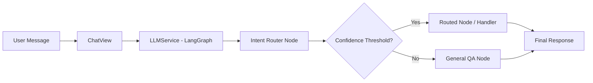

## What Was Built

The intent system uses **LangGraph** to classify user queries and route them to specialized nodes or handlers. This provides a robust, stateful way to handle complex conversational flows.

### Architecture



## Files Changed

### New Files

| File | Purpose |
|------|---------|
| [registry.py](file:///Users/karthiknarayan/veto/samsr-backend/apps/assistant/intents/registry.py) | Static intent definitions (name, handler, thresholds, schemas) |
| [general_qa.py](file:///Users/karthiknarayan/veto/samsr-backend/apps/assistant/intents/handlers/general_qa.py) | Handler for generic QA — passes through to LLM |
| [intent_dispatcher.py](file:///Users/karthiknarayan/veto/samsr-backend/apps/assistant/services/intent_dispatcher.py) | Dynamic `importlib`-based handler resolution & execution |

### Modified Files

| File | Change |
|------|--------|
| [llm_service.py](file:///Users/karthiknarayan/veto/samsr-backend/apps/assistant/services/llm_service.py) | Static registry integration, `execute_intent()` method |
| [base.py](file:///Users/karthiknarayan/veto/samsr-backend/apps/assistant/services/providers/base.py) | Added `_extract_json()` helper for markdown fence stripping |
| [aws_bedrock_native.py](file:///Users/karthiknarayan/veto/samsr-backend/apps/assistant/services/providers/aws_bedrock_native.py) | Real AI intent classification via Converse API |
| [fake.py](file:///Users/karthiknarayan/veto/samsr-backend/apps/assistant/services/providers/fake.py) | Returns `general_qa` instead of `GENERAL` |
| [chat.py](file:///Users/karthiknarayan/veto/samsr-backend/apps/assistant/views/chat.py) | AI classification → dynamic handler dispatch flow |
| [message.py](file:///Users/karthiknarayan/veto/samsr-backend/apps/assistant/models/message.py) | `intent_id` (UUID) → `intent_name` (CharField) |
| [message.py](file:///Users/karthiknarayan/veto/samsr-backend/apps/assistant/serializers/message.py) | Updated serializer fields |

### Intent Schema

Each intent is defined with these fields:

```python
{
    "name": "general_qa",
    "description": "General knowledge questions...",
    "required_entities": [],
    "handler": "apps.assistant.intents.handlers.general_qa.handle",
    "confidence_threshold": 0.3,
    "allowed_tools": [],
    "input_schema": {"query": "str"},
    "output_schema": {"answer": "str"},
    "temperature": 0.7,
    "max_input_tokens": 4096,
    "max_output_tokens": 4096,
}
```

### LLM Classification Output

The LLM returns structured JSON:

```json
{"intent_name": "general_qa", "confidence": 0.95}
```

## Testing

All **9 Playwright tests passed** (17.6s):

- ✅ User can create thread
- ✅ User can list threads
- ✅ User can get specific thread
- ✅ User can send message (JSON, `stream=false`)
- ✅ User can send message (SSE streaming, `stream=true`)
- ✅ User can send message (default stream behavior)
- ✅ User can list messages for thread
- ✅ User can update thread
- ✅ User can delete thread

### Key Observation from Logs

The AI correctly classifies queries as `general_qa` with high confidence:

```
Intent classification raw response: {"intent_name": "general_qa", "confidence": 0.95}
Intent classified: intent_name=general_qa confidence=0.95 matched=True
Dispatching intent handler: handler=apps.assistant.intents.handlers.general_qa.handle
```

## Adding New Intents

To add a new intent:

1. Add an entry to `INTENT_REGISTRY` in [registry.py](file:///Users/karthiknarayan/veto/samsr-backend/apps/assistant/intents/registry.py)
2. Create a handler in `apps/assistant/intents/handlers/your_intent.py` with a `handle(query, history, intent_config, llm_service, stream=False)` function
   - Non-streaming: return `LLMResponse` (from `providers.base`)
   - Streaming: return `Iterator[str | dict]` (text chunks + citation dicts)
3. The system will automatically classify and dispatch — no if/else needed
